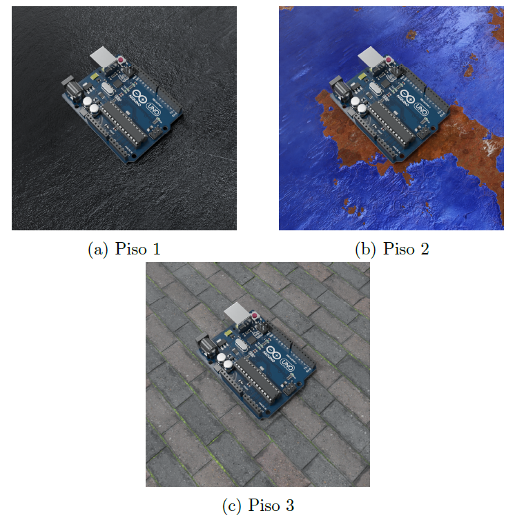
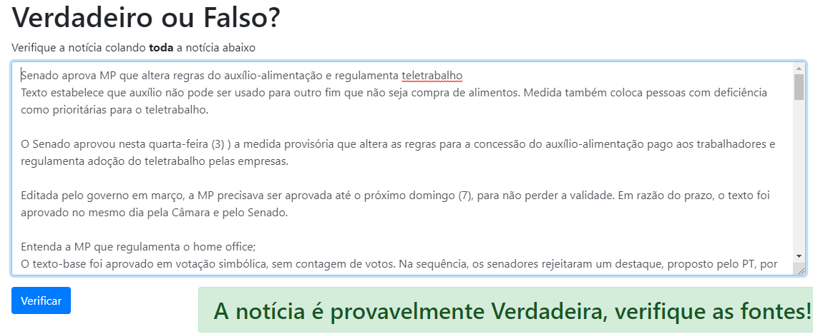

# Vítor Ishikura
## Portifólio
### Detector de falhas em circuitos impressos

Esse trabalho foi realizado como TCC (trabalho de conclusão de curso) ao término da graduação em Eng. Elétrica na Poli-USP.

Ele teve como objetivo implementar um detector capaz de discernir falhas em placas de Arduinos Uno reais por meio de uma rede neural treinada por dados sintéticos gerados por meio de computação gráfica.

Artigo disponível [aqui](https://drive.google.com/file/d/1tBcJRBBMM7IhPOpFVx2clE3JbR4QnoGn/view?usp=sharing)

### Detector de Fake News

O objetivo aqui foi criar um classificador de notícias falsas utilizando NLP a partir de notícias previamente rotuladas no dataset [Fake.Br Corpus](https://github.com/roneysco/Fake.br-Corpus). A segunda etapa foi tornar o classificador público por meio de um site. Ambas as etapas do projeto podem ser exploradas abaixo:

* Análise e implementação do modelo: [repositório](https://github.com/vitorhi/Detector-fake-news/blob/master/Analise/Detector_Fake_News.ipynb)
* Detector de notícias falsas: [site](https://detector-noticia.herokuapp.com)