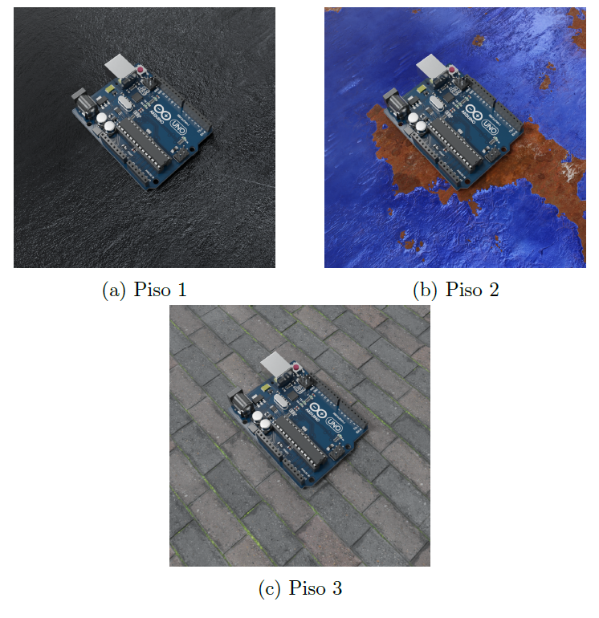

### Detector de falhas em circuitos impressos

Esse trabalho foi realizado como TCC (trabalho de conclusão de curso) em conjunto com os ex-alunos Lucas Ribeiro Ferreira Julio e Erik Kazuhiro Miyoshi ao término da graduação em Eng. Elétrica na Poli-USP.

Ele teve como objetivo implementar um detector capaz de discernir falhas em placas de Arduinos Uno reais por meio de uma rede neural treinada por imagens sintéticas gerados a partir de computação gráfica.

Artigo disponível [aqui](https://drive.google.com/file/d/1tBcJRBBMM7IhPOpFVx2clE3JbR4QnoGn/view?usp=sharing)


### Detector de Fake News

O objetivo aqui foi criar um classificador de notícias falsas utilizando NLP a partir de notícias previamente rotuladas no dataset [Fake.Br Corpus](https://github.com/roneysco/Fake.br-Corpus). A segunda etapa foi tornar o classificador público por meio de um site. Ambas as etapas do projeto podem ser exploradas abaixo:

* Análise e implementação do modelo: [repositório](https://github.com/vitorhi/Detector-fake-news/blob/master/Analise/Detector_Fake_News.ipynb)
* Detector de notícias falsas: [site](https://detector-noticia.herokuapp.com)
```
